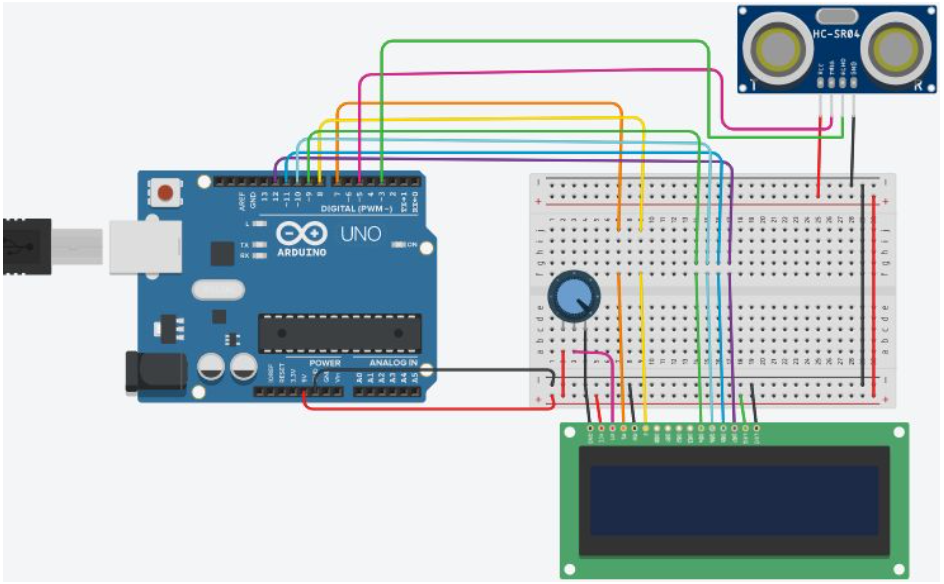
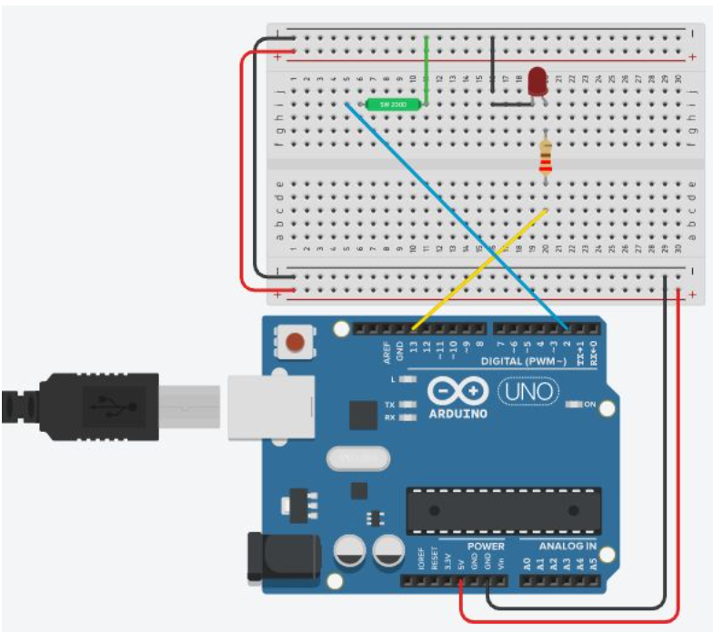

# ultrasonic-sensor-tilt-switch
> This repository contains 2 tasks. Task 1 uses an ultrasonic sensor to display distance readings via an LCD.
> Task 2 implements a tilt swtich to turn an LED on and off. When the tilt switch is on, the LED turns on. When the tilt switch is off, the LED is off.

## Table of contents
* [General info](#general-info)
* [Technologies](#technologies)
* [Circuit Setup](#circuit-setup)
* [Status](#status)
* [Contact](#contact)

## General info
The purpose of this project is to explore the contents in the ELEGOO UNO Starter Kit and Atmega328 uController

## Technologies
* ArduinoIDE- version 1.8.13

## Circuit Setup

>Ultrasonic Sensor Circuit that reads Distance

>Tilt Switch that Turns On and Off LED

## Status
Project is: _finished_

## Contact
Created by [@akansha-n888](https://www.linkedin.com/in/akansha-nagar/) - feel free to contact me!
